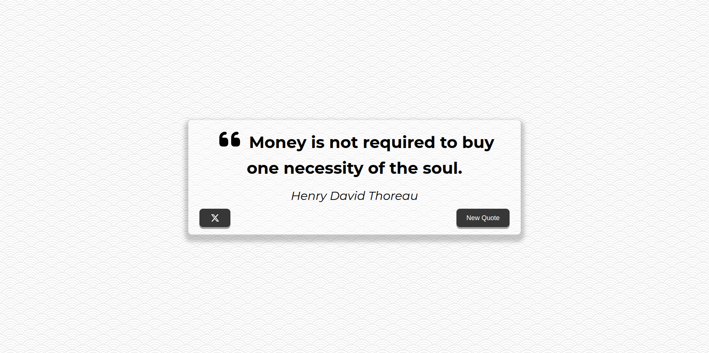

<div align="center">

# 💬 Quote Generator

> A clean and responsive random quote generator with one-click tweeting.

    

</div>

## 📖 About

Quote Generator fetches a curated list of quotes and displays a new random one on each click. Found a quote you love? Tweet it instantly with a single button. Built with vanilla JavaScript and Vite, with a focus on performance — achieving a perfect **100/100 Lighthouse score** across all categories.

## ✨ Features

- 🎲 Random quote on every click
- 🐦 Tweet any quote directly to X (Twitter)
- 📦 Offline-ready with localStorage caching — quotes load instantly after the first visit
- ⚡ Optimized loading with font and asset preloading
- 📱 Fully responsive for mobile and tablet
- ♿ Accessible and SEO-friendly

## 🖥️ Demo



## 🚀 Getting Started

### Prerequisites

- [Node.js](https://nodejs.org/) 18+
- npm 9+

### Installation

```bash
# Clone the repository
git clone https://github.com/pmbfsa/quote-generator.git

# Navigate into the project
cd quote-generator

# Install dependencies
npm install
```

### Running locally

```bash
npm run dev
```

Press `o + enter` to open in your browser.

### Building for production

```bash
npm run build
```

The output will be in the `dist/` folder.

### Preview the production build

```bash
npm run preview
```

Press `o + enter` to open in your browser.

## 🛠️ Built With

| Technology                                                 | Purpose                           |
| ---------------------------------------------------------- | --------------------------------- |
| HTML5 / CSS3 / JavaScript                                  | Core structure, styling and logic |
| [Vite 8](https://vite.dev)                                 | Build tool powered by Rolldown    |
| [Web Awesome Icons](https://webawesome.com)                | Icon components                   |
| [Montserrat](https://fonts.google.com/specimen/Montserrat) | Typography (self-hosted)          |
| [Quotes API](https://jacintodesign.github.io/quotes-api/)  | Quote data source                 |

## ⚡ Performance

This project was optimized to achieve a perfect Lighthouse score:

- **Font preloading** — `<link rel="preload">` for self-hosted `.woff2` files to eliminate the font dependency chain
- **Asset preloading** — custom Vite plugin injects `modulepreload` and `preload` tags for JS and CSS automatically on every build
- **Zero layout shift** — loader/quote transition uses `visibility` instead of `hidden` to keep layout space reserved
- **Quote caching** — quotes are cached in `localStorage` for 24h, rendering instantly on repeat visits with background refresh

## 📁 Project Structure

```
quote-generator/
├── public/
│   └── favicon.png
├── src/
│   ├── assets/
│   │   └── fonts/
│   │        ├── montserrat-v31-latin-700.woff2
│   │        ├── montserrat-v31-latin-700italic.woff2
│   │        ├── montserrat-v31-latin-italic.woff2
│   │        └── montserrat-v31-latin-regular.woff2
│   ├── styles/
│   │   ├── fonts.css
│   │   └── style.css
│   ├── main.js
│   └── quotes.js
├── index.html
├── package.json
└── vite.config.js
```

## 📄 License

Distributed under the GPLv3 License. See [LICENSE](./LICENSE) for more information.
